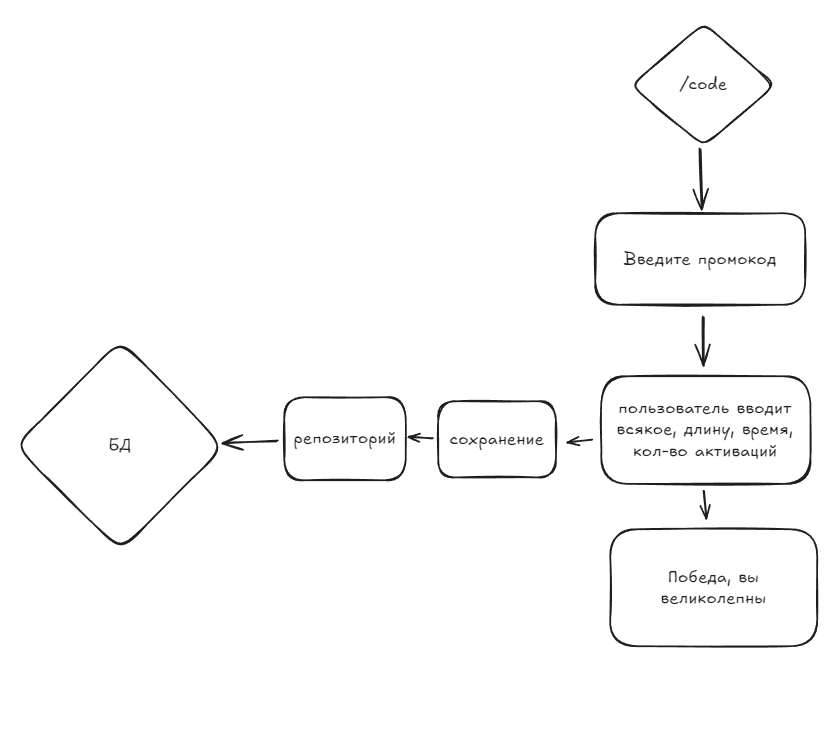

# promo-bot

В какой-то моменты тут будут надписи

## TODO

- [x] визард на 1 поле
- [x] Запустить минимального работающего визарда на 3 поля
- [x] принимать значение длины писи
- [x] количество применений
- [x] Время начала(по дефолту будет время создания)
- [x] Время конца(опционально)
- [x] Все что выше попробу реализовать через структуру в `internal/model`. Нужно через action проложить в структуры, и wizard Description
- [x] Переделать функцию `extractPromoInfo(fields wizard.Fields) (string, string, string, string)`, сейчас это дикий костыль на 4 возвращаемых значения. Переделаю в `extractPromoInfo(fields wizard.Fields, fieldName string) (string)`
- [x] Развернуть БД
- [ ] по нормальному сделать миграции, а не через докер
- [ ] `Вообще, я потом тебя ещё попрошу сделать селекты из базы, чтобы список промиков получать и информацию по коду`
[https://t.me/kozaloru_chat/27070]

## Как должен рабоать

## Как работает сейчас

А он кстати работает верно!, ну почти, база данных то неверная. Но главное сохраняет